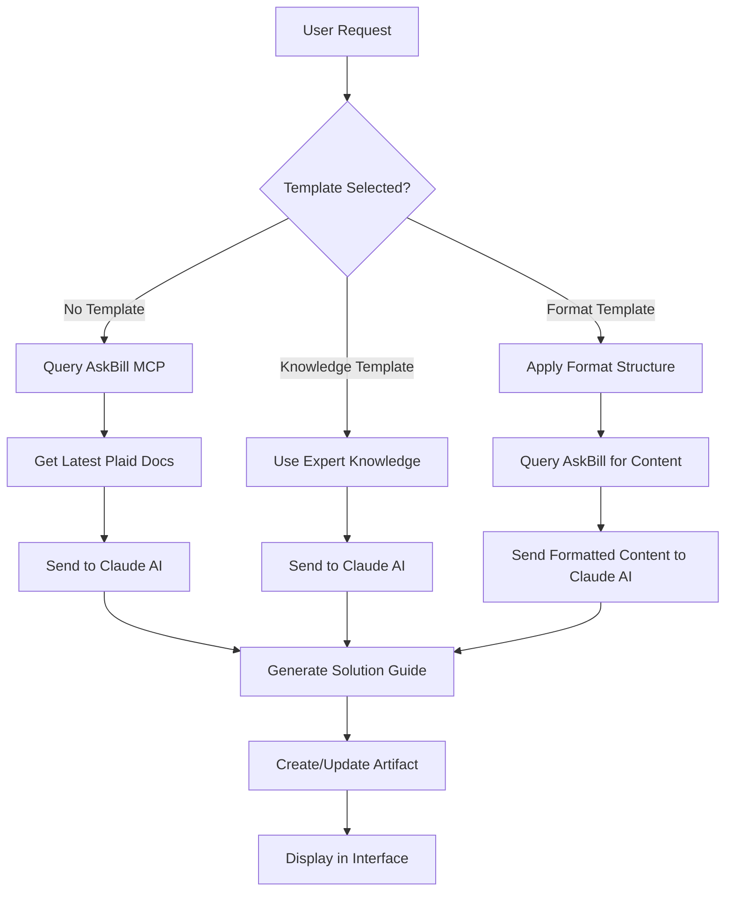
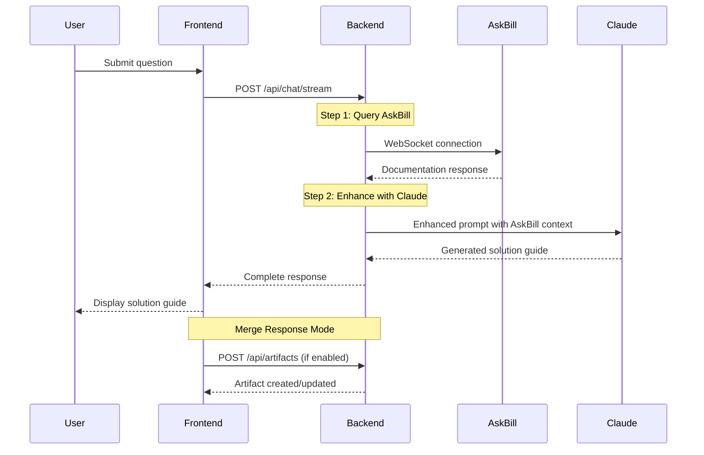

# Plaid Solution Guide Generator

**AI-Powered Solution Guide Creation for Sales Engineers**

An application that combines the power of AskBill MCP service, Knowledge Templates, and Claude AI to rapidly generate comprehensive solution guides. Designed specifically for Sales Engineers to quickly create bespoke PreSales assets and documentation.

## 🚀 Overview

The Plaid Solution Guide Generator is an intelligent assistant that helps Sales Engineers create solution guides by leveraging three key technologies:

- **AskBill MCP Service**: Real-time access to current Plaid documentation
- **Knowledge Templates**: Expert-curated, authoritative content for specific use cases that override the AskBill MCP Service when used
- **Format Templates**: Override the system prompt default format and create your own templates for AI instructions for each section
- **Claude AI**: Intelligent content generation and enhancement

## 🚀 Quickstart

Get up and running in minutes with these simple steps:

### **Prerequisites**
- Node.js 16+ and npm
- Python 3.8+
- Git
- **Anthropic API Key** (required for Claude AI)
- **Plaid VPN Access** (required for AskBill MCP service)

**🍎 macOS Setup (if not already installed):**
```bash
# Install Homebrew (package manager for macOS)
/bin/bash -c "$(curl -fsSL https://raw.githubusercontent.com/Homebrew/install/HEAD/install.sh)"

# Install Node.js (includes npm)
brew install node

# Install Python 3
brew install python

# Install Git
brew install git

# Verify installations
node --version    # Should show v16+ 
python3 --version # Should show 3.8+
git --version     # Should show git version
```

### **Step 1: Open Terminal**
**On Mac:**
- Press `Cmd + Space` and type "Terminal"
- Or go to Applications → Utilities → Terminal

**On Windows:**
- Press `Win + R`, type `cmd`, and press Enter
- Or search for "Command Prompt" in Start menu

**On Linux:**
- Press `Ctrl + Alt + T`
- Or search for "Terminal" in your applications

### **Step 2: Clone the Repository**
```bash
git clone https://github.com/thedmaj/plaid-solution-guide.git
cd plaid-solution-guide
```

### **Step 3: Get Your API Key**
1. **Login to Anthropic console through Okta homepage and generate an API key** or obtain an API key from a team member
2. If generating yourself: Navigate to **API Keys** section in [Anthropic Console](https://console.anthropic.com/)
3. Create a new API key
4. Copy the key (starts with `sk-ant-api03-`)
5. **Keep this key safe** - you'll need it in Step 6

### **Step 4: Run Installation Script**
```bash
chmod +x install-plaid-guide.sh
./install-plaid-guide.sh
```

### **Step 5: Configure Environment**
```bash
# Copy the sample environment file
cp backend/.env.sample backend/.env

# Generate a secure JWT secret key
openssl rand -hex 32
```

### **Step 6: Edit Configuration**
1. **Find .env file**: `backend/.env` (use `Cmd + Shift + .` on Mac to see hidden files)
2. **Edit the file** with your preferred text editor (TextEdit on Mac, Notepad on Windows)
3. **Add your API key**: Replace `your_anthropic_api_key_here` with your actual key from Step 3
4. **Add JWT secret**: Replace `your_jwt_secret_key_here` with the generated key from Step 5
5. **Verify VPN**: Ensure you're connected to Plaid VPN for AskBill access
6. **Save the file** (Cmd+S on Mac, Ctrl+S on Windows)

### **Step 7: Launch the Application**
```bash
chmod +x launch.sh
./launch.sh
```

### **Step 8: Access the Application**
- **Frontend**: http://localhost:3000 (opens automatically)
- **Backend**: http://localhost:8000
- **Default Login**: admin@example.com / admin123

🎉 **You're ready to go!** The application will start both frontend and backend servers automatically.

---

## 🎯 Key Features


### 🔄 **Response Modes**
- **Chat Only Mode**: Standard conversational responses
- **Merge Response Mode**: Automatically merges responses into a session artifact in markdown format 
- **Artifact Creation**: Generates standalone documents that can be exported

### 🎨 **Advanced Features**
- **Session Workspaces**: Organize related artifacts and conversations
- **Version Control**: Track changes and updates to solution guides
- **Smart Merging**: Intelligently combine new information with existing content
- **Export Capabilities**: Download or copy/paste artifacts 

## 🧠 How It Works

### The AI Trinity: AskBill + Knowledge Templates + Claude



### AskBill Direct Mode - Detailed Sequence



### **1. AskBill MCP Service Integration**
- **Real-time Documentation Access**: Connects to Plaid's internal documentation system
- **URL Validation**: Ensures all links and references are current and accurate
- **API Coverage**: Comprehensive access to all Plaid APIs and endpoints
- **Always Current**: Never uses outdated information

### **2. Knowledge Templates**
- **Expert-Curated Content**: Pre-validated by Plaid experts for accuracy
- **Complex Use Cases**: Perfect for intricate implementations requiring specific guidance
- **Authoritative Source**: Takes precedence over general AI knowledge when conflicts arise
- **Structured Approach**: Ensures consistent, professional output

### **3. Claude AI Enhancement**
- **Intelligent Processing**: Transforms raw documentation into polished guides
- **Context Understanding**: Grasps complex technical requirements and customer needs
- **Professional Formatting**: Creates well-structured, readable documentation
- **Adaptive Responses**: Tailors content based on technical level and requirements

## 📋 Template Selection Guide

### **Knowledge Templates** 🧠
*Use when you need expert-validated, authoritative guidance*

**When to Use:**
- Complex implementations requiring specific technical approaches
- Circumvent AskBill and use an authoritative source
- Where accuracy is paramount 


**Benefits:**
- ✅ Expert-validated content
- ✅ Authoritative and accurate
- ✅ Handles complex scenarios
- ✅ Consistent methodology

### **Format Templates** 📝
*Use for standardized document structures*

**When to Use:**
- When you want to create your own solution guide structure 


## ⚙️ Response Modes

### **Chat Only Mode** 💬
- Standard conversational interface
- Responses appear only in chat
- No automatic document creation
- Best for: Quick questions, clarifications, brainstorming

### **Merge Response Mode** 🔄
- Automatically creates and updates solution guide documents
- Builds comprehensive guides over multiple exchanges
- Each response enhances the living document
- Best for: Building comprehensive solution guides, iterative development

**Pro Tip**: Start in Merge Mode when you want to build a comprehensive guide that will evolve throughout your conversation.

## 🔧 Advanced Configuration

### Alternative JWT Key Generation
If `openssl` is not available, use these alternatives:

```bash
# Python method
python3 -c "import secrets; print(secrets.token_hex(32))"

# Node.js method
node -e "console.log(require('crypto').randomBytes(32).toString('hex'))"
```

### Virtual Environment Note
The installation script automatically creates and manages a Python virtual environment. Never install dependencies globally.


## 🎯 Usage Guide

### **Login**
- Email: `admin@example.com` / Password: `admin123`

### **Quick Start Tips**
- **Chat Only Mode**: For quick questions and exploration
- **Merge Response Mode**: For building comprehensive solution guides
- **Knowledge Templates**: Use for complex, well-defined use cases
- **Format Templates**: Use for standard implementations with custom structure

### **Template Selection**
| Use Case | Template Type | Example |
|----------|---------------|---------|
| Complex regulatory | Knowledge Template | "CRA Base Report Implementation" |
| Standard integration | Format Template | "Solution Guide Template" |
| Custom requirement | No Template | Direct conversation |

## 🏗️ Architecture

**Frontend (React)**: Modern UI with real-time updates, template management, and workspace organization  
**Backend (FastAPI)**: Claude AI integration, AskBill MCP client, smart merging, SQLite database  
**Key Flow**: AskBill → Claude → Artifacts with intelligent content generation


## 🎨 User Interface Guide

### **Sidebar Navigation**
- **Chats Tab**: Browse conversation history with auto-generated titles
- **Artifacts Tab**: Access all created documents and guides
- **Session Workspaces**: Organized view of related artifacts

### **Chat Interface**
- **Template Selector**: Choose Knowledge, Format, or No Template
- **Response Mode Toggle**: Switch between Chat Only and Merge Response
- **Message Actions**: Copy responses, view artifact icons

### **Artifact Panel**
- **Live Document View**: See your solution guide build in real-time
- **Version Control**: Track changes and updates
- **Export Options**: Download in multiple formats


## 🚨 Troubleshooting

### Common Issues
- **App won't start**: Check API key in `backend/.env` and ensure it starts with `sk-ant-api03-`
- **Backend errors**: Verify virtual environment exists (`ls backend/venv`) or re-run install script
- **Frontend errors**: Check Node.js 16+ and try `npm install` in frontend folder
- **AskBill issues**: Ensure Plaid VPN is active and `ASKBILL_URL` is correct
- **Authentication**: Use default login `admin@example.com` / `admin123`

### Quick Fixes
```bash
# Re-run installation
./install-plaid-guide.sh

# Check if running
./launch.sh
```

## 📞 Support

For technical support or questions:
- Check the troubleshooting section above
- Review backend logs for error details
- Verify all prerequisites are installed
- Ensure proper API keys and configurations

---

**Happy Solution Guide Generation! 🎉**

*This application is designed to make Sales Engineers more productive by leveraging the combined power of AI and authoritative documentation.*