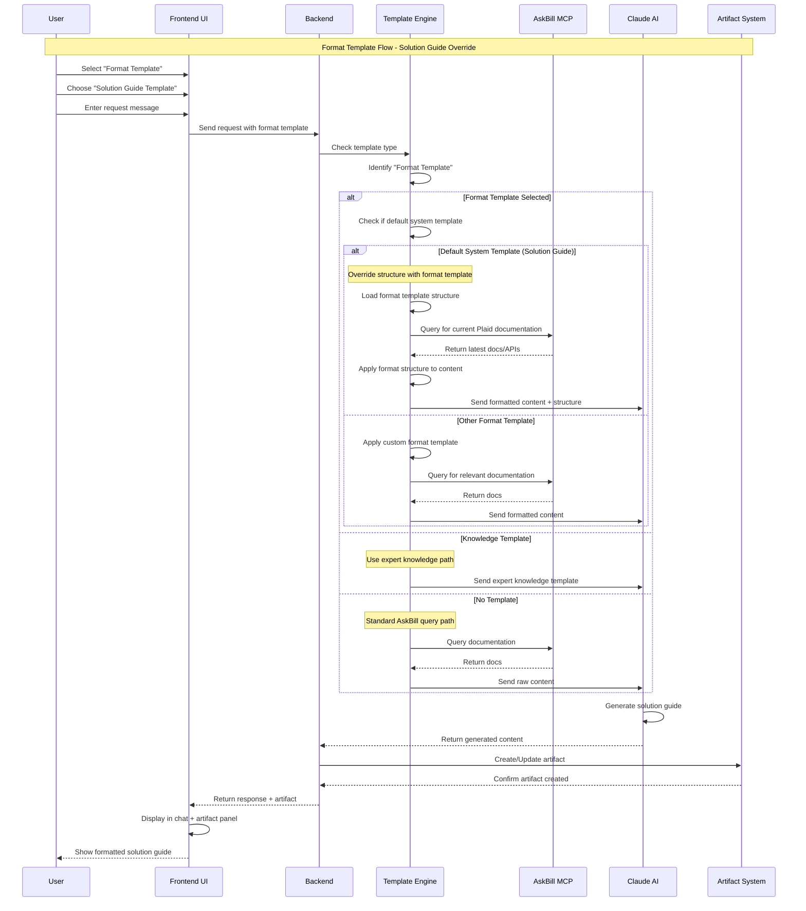

# Format Template Logic - Mermaid Sequence Diagram

## Key Logic Points:

1. **Format Template Detection**: System identifies when a format template is selected
2. **Default System Template Check**: Special handling for "Solution Guide" template
3. **Structure Override**: Format template structure overrides default system layout
4. **Content Sourcing**: Still queries AskBill for current documentation
5. **Formatted Processing**: Content is structured according to format template before sending to Claude
6. **Final Generation**: Claude generates the solution guide with the imposed structure
7. **Artifact Creation**: Result is displayed in both chat and artifact panel

## Format Template Priority:
- **Structure**: Defined by Format Template
- **Content**: Sourced from AskBill (current docs)
- **Intelligence**: Enhanced by Claude AI
- **Result**: Structured solution guide following format template layout